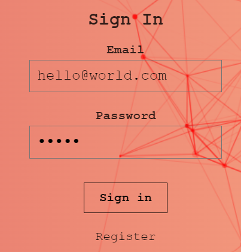

# Smart Brain Client

A React App that detects, then highlights faces in web images. Including a user profile with image upload count and a Ranking Badge served from AWS Lambda as a serverless function.

Built with React.js, Node.js, Express, Bcrypt, PostgreSQL, Redis, Tachyon CSS, Clarifai Face Detection API, and all running on Heroku Servers 'synched' with GitHub.

## Demo

  
:rocket: **[View Live Demo](https://sonny-smart-brain.herokuapp.com/)** :rocket: 
  

## How to use

You can use the following test login details <i>(ensure lowercase as case sensitive)</i>

 
<b>Email:</b> hello@world.com
 
<b>Password:</b> world
 

  
 
 
_**Please note: Site may take a few seconds to initially load due to using Heroku .**_
